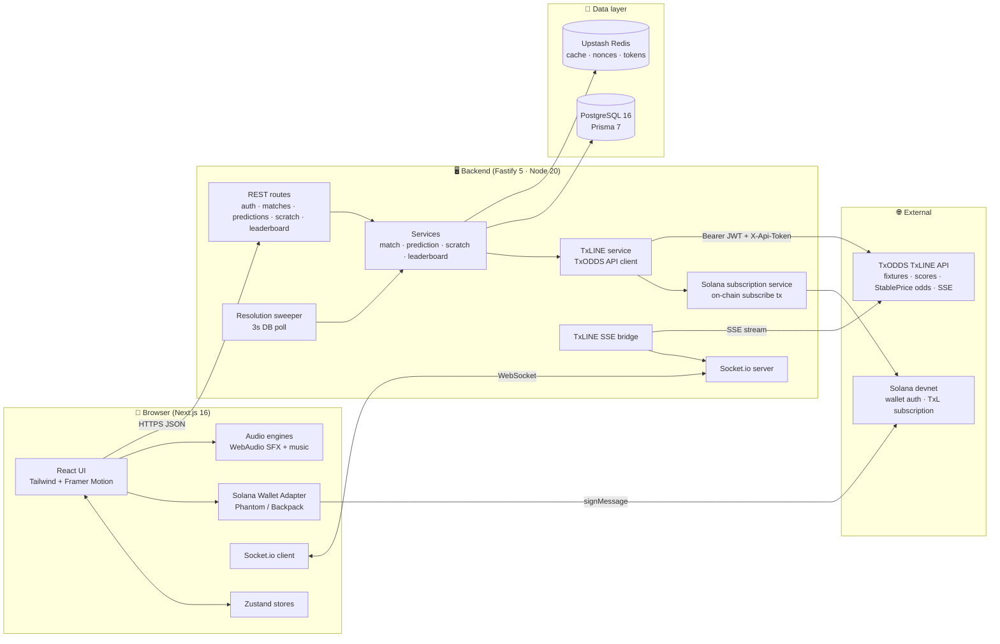
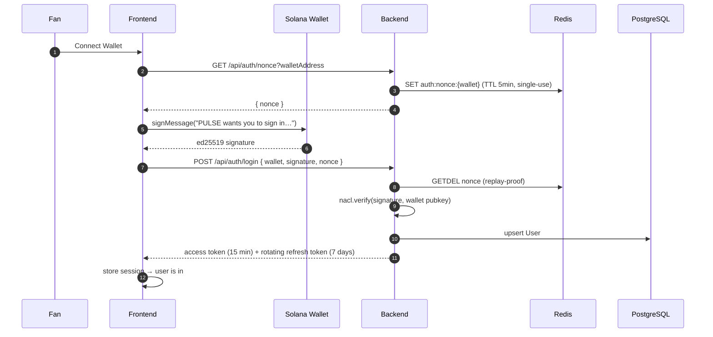
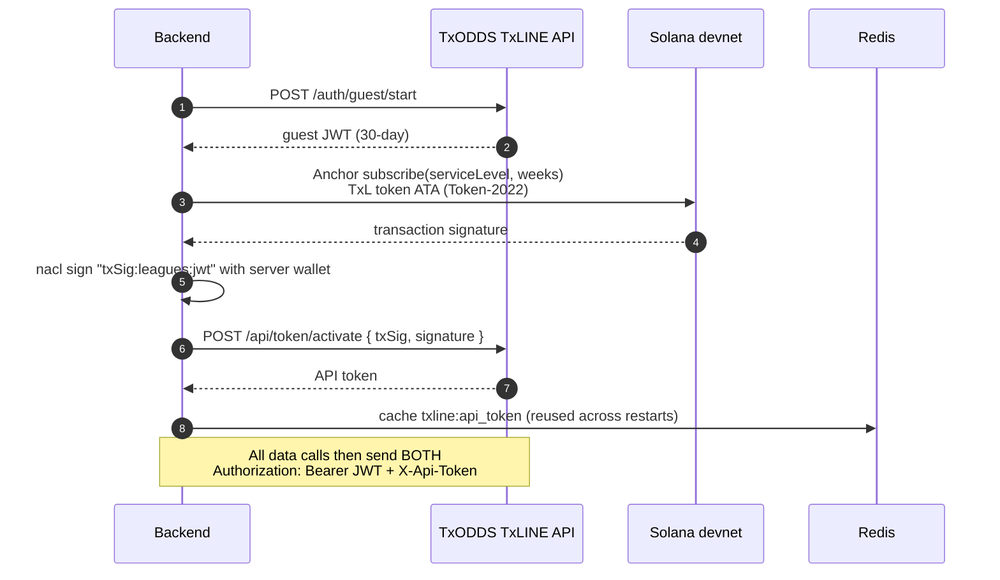
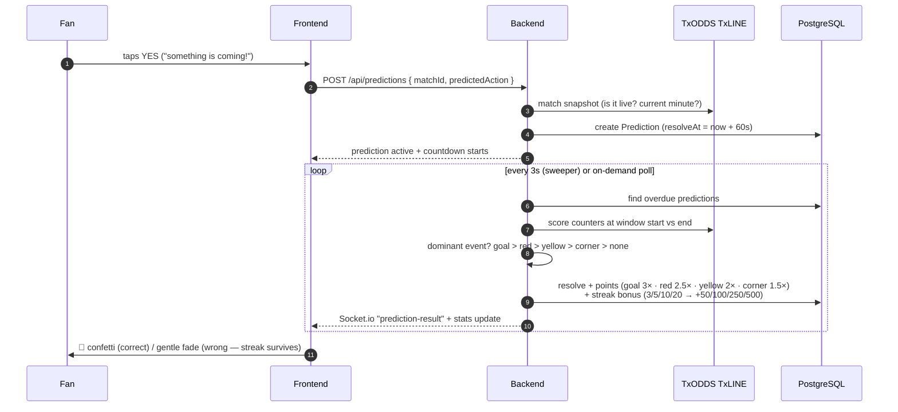
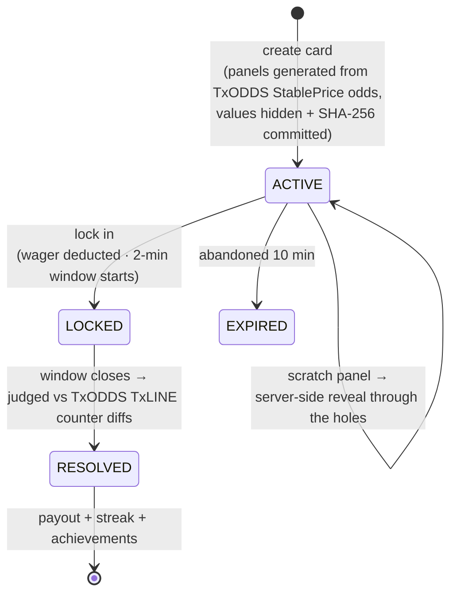
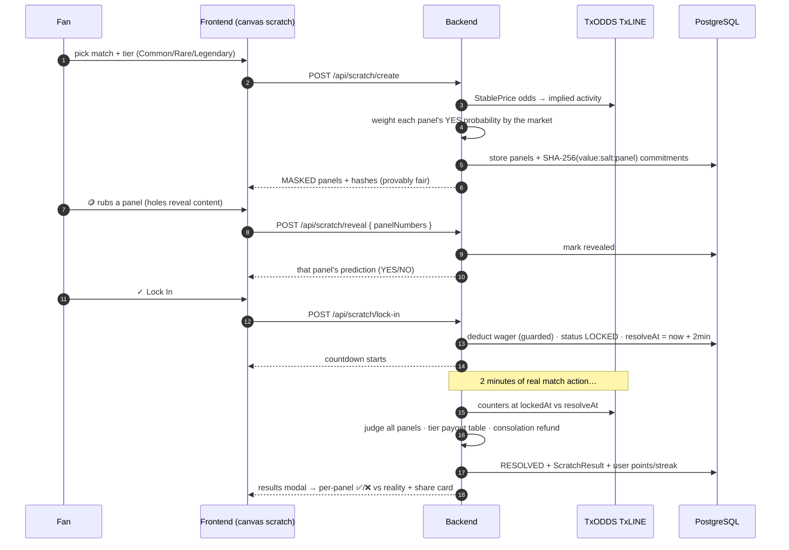
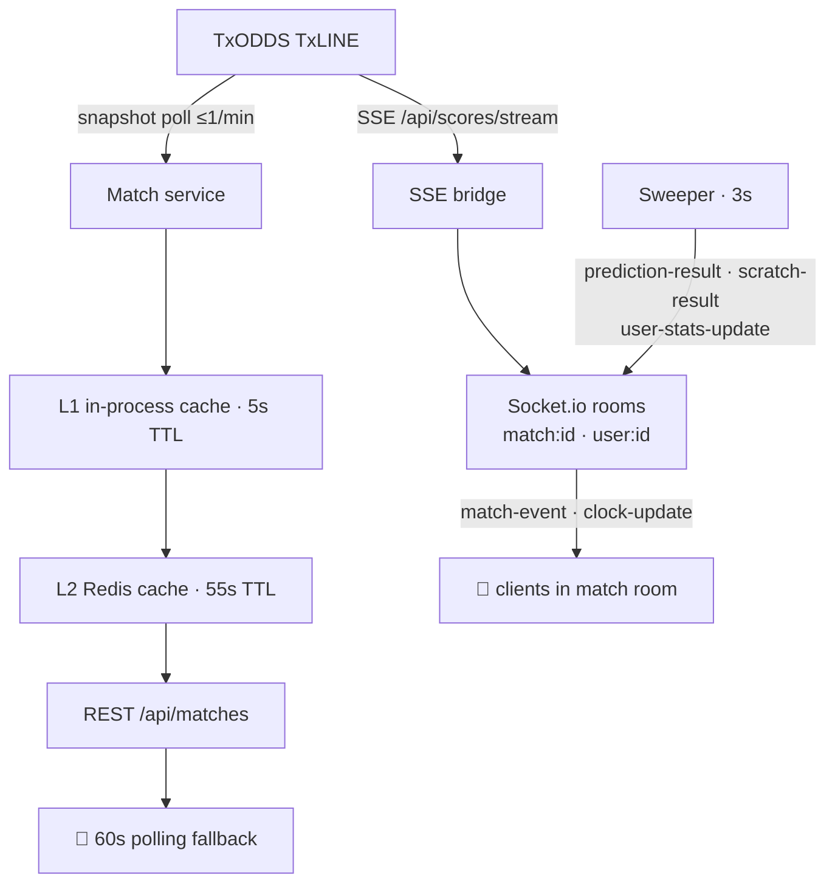
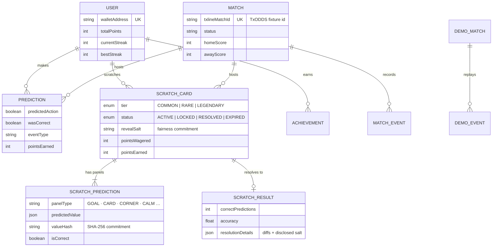
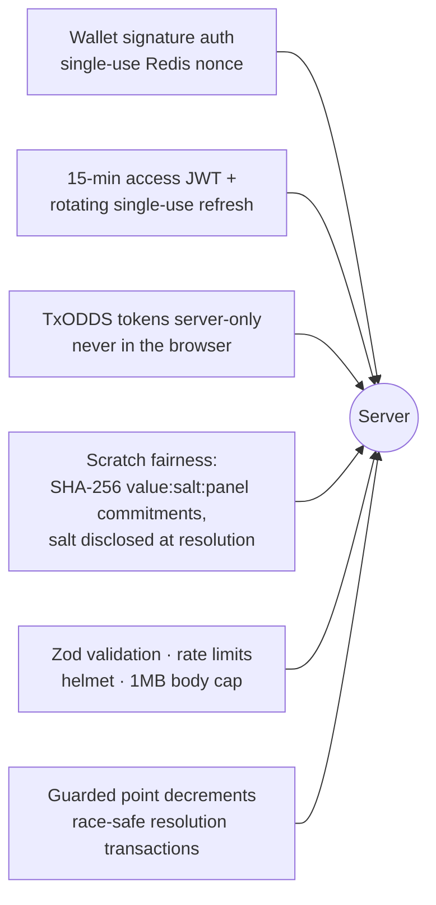

# 🔬 How PULSE Works — Full System Diagrams

Every diagram below reflects the actual implementation. Data source of truth everywhere: **TxODDS TxLINE**.

---

## 1. System Architecture

---

## 2. Wallet Sign-In (passwordless, no email)

---

## 3. TxODDS TxLINE Activation (server-side, on-chain)

---

## 4. Live Micro-Prediction Lifecycle (60-second windows)

---

## 5. 🎴 Pulse Scratch Lifecycle

### State machine

### Full flow

### Payout tables

```mermaid
flowchart TD
    subgraph Common["COMMON — free · 6 panels"]
        C6["6/6 → +500"] ~~~ C5["5/6 → +300"] ~~~ C4["4/6 → +150"] ~~~ C3["3/6 → +50"]
    end
    subgraph Rare["RARE — 100 pts · 9 panels"]
        R9["9/9 → +2000"] ~~~ R7["7/9 → +500"] ~~~ R4["4/9 → +50"] ~~~ RB["below 6/9 → 50 pts back"]
    end
    subgraph Legendary["LEGENDARY — 500 pts · 12 panels"]
        L12["12/12 → +10000"] ~~~ L10["10/12 → +2000"] ~~~ L8["8/12 → +500"] ~~~ LB["below 8/12 → 250 pts back"]
    end
```

---

## 6. Real-Time Data Flow

> The client never depends on the socket alone — polling backstops every real-time path, so a dropped WebSocket degrades gracefully instead of breaking the game.

---

## 7. Data Model

---

## 8. Security Model (quick reference)

